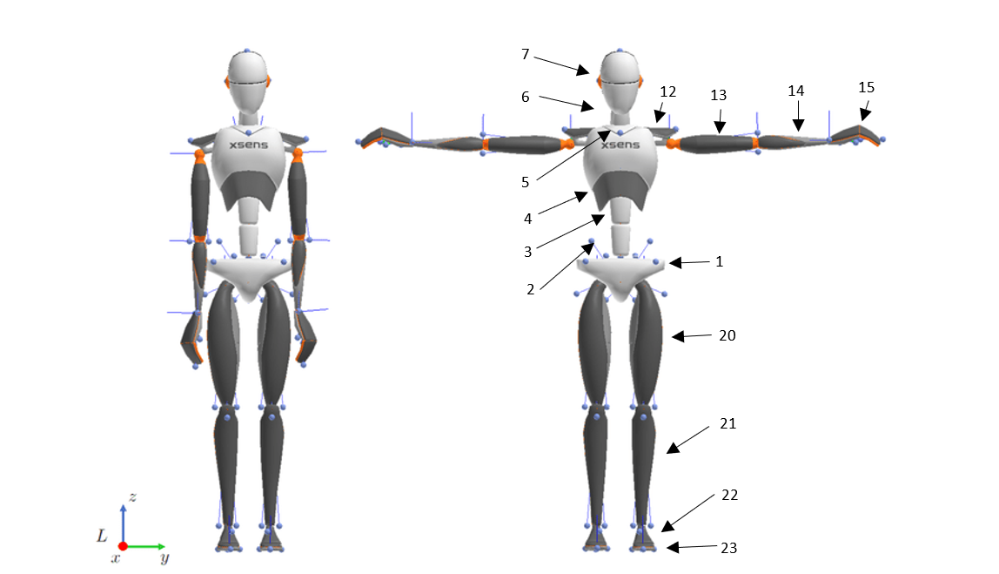

# Sample squat and bridge motion data

Full-body motion capture data collected using an Xsens MVN inertial mocap system.

An mp4 video of the motion is provided in each folder.

Rotational (roll, pitch, yaw) and translational (x, y, z) position data are provided for each body segment. A separate text file is provided for each body segment.

See the [MVN manual](https://www.xsens.com/hubfs/Downloads/usermanual/MVN_User_Manual.pdf) chapter 23.5 for definition of segment roll/pitch/yaw and x/y/z directions

Files contain columns of: time, roll, pitch, yaw, x position, y position, z position.

Body segments are defined as follows:

1. Pelvis  
2. L5  
3. L3  
4. T12  
5. Sternum (T8)  
6. Neck  
7. Head  
8. Right shoulder  
9. Right upper arm  
10. Right fore arm  
11. Right hand  
12. Left shoulder  
13. Left upper arm  
14. Left fore arm  
15. Left hand  
16. Right upper leg  
17. Right lower leg  
18. Right foot  
19. Right toe  
20. Left upper leg  
21. Left lower leg  
22. Left foot  
23. Left toe

Segment numbers correspond to the following diagram:
  

For more detailed description, see:
https://base.xsens.com/hc/en-us/articles/360011485019-MVN-Biomechanical-Model

Xsens MVN manual, chapter 23.5
https://www.xsens.com/hubfs/Downloads/usermanual/MVN_User_Manual.pdf